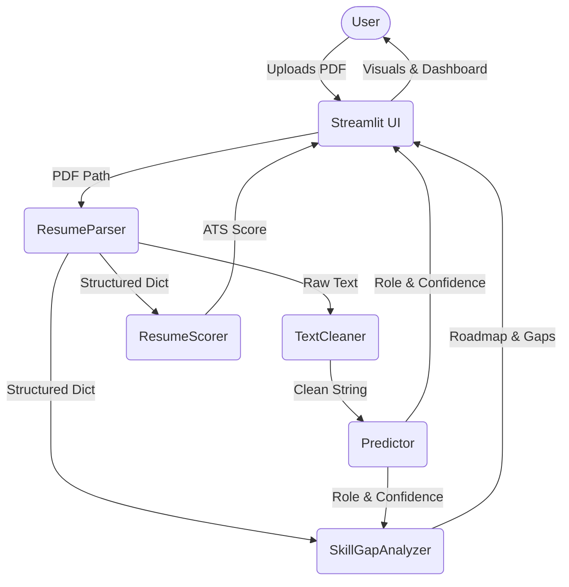
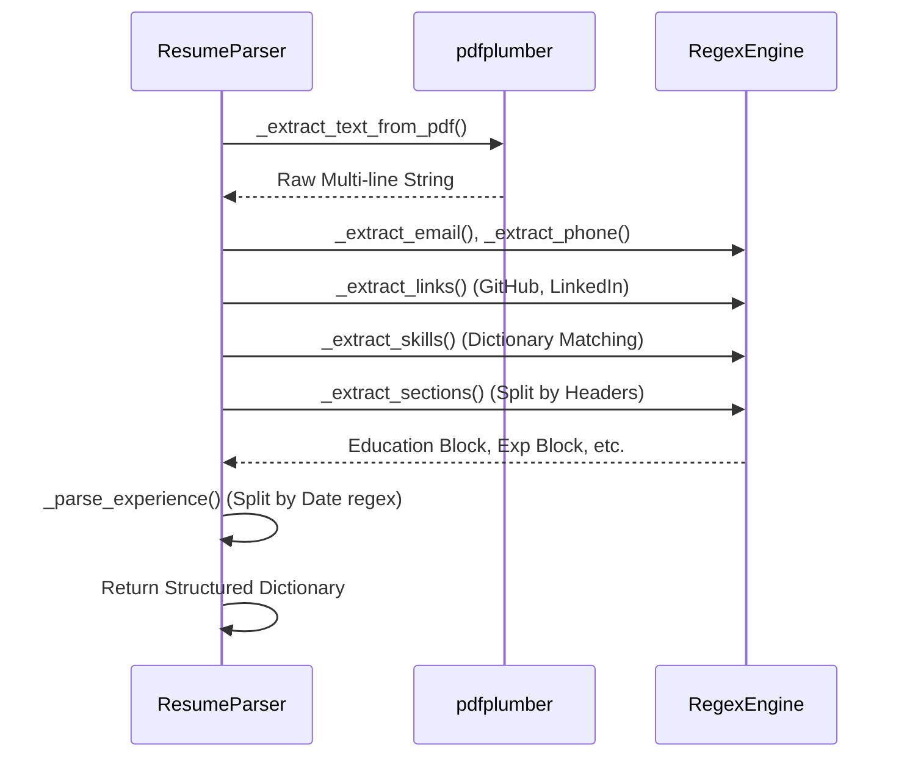

# System Architecture

This document outlines the technical architecture and data flows of the **AI Career Intelligence Platform**.

## 1. High-Level System Flow

## 2. Machine Learning Pipeline (Offline & Online)

The platform relies on a dual-phase ML approach:

1. **Training Phase (Offline in `scripts/`)**:
   - Ingests `Resume.csv` containing raw historical resumes.
   - Applies NLTK stopwords, lemmatization, and regex cleaning.
   - Transforms text using `TfidfVectorizer`.
   - Trains a `DecisionTreeClassifier`.
   - Serializes artifacts to `models/` (career_model.pkl, vectorizer.pkl, label_encoder.pkl).

2. **Inference Phase (Online in `utils/predictor.py`)**:
   - Streamlit loads `.pkl` files into memory via `@st.cache_resource` on boot.
   - Extracts string from uploaded PDF.
   - Applies the EXACT same `clean_text()` function.
   - Calls `vectorizer.transform()` and `model.predict_proba()`.
   - Returns JSON containing predicted role and statistical confidence.

## 3. Resume Parser Flow (`utils/parser.py`)

Unlike standard NER (Named Entity Recognition) models like SpaCy, this platform utilizes a highly optimized deterministic regex and heuristic engine for maximum stability and speed.

## 4. Component Interaction

- **State Management**: The application utilizes Streamlit's `st.session_state` to pass the large extracted dictionaries between pages without re-running the ML pipeline.
- **UI Components (`app/ui_components.py`)**: Responsible for consuming raw data dictionaries and spitting out high-fidelity HTML/CSS cards containing Plotly visualizations. All HTML is secured with `textwrap.dedent`.
- **Config (`config/settings.py`)**: Houses the application state, skill lists, and mapping normalizations, preventing cyclic imports across the `utils/` folder.
